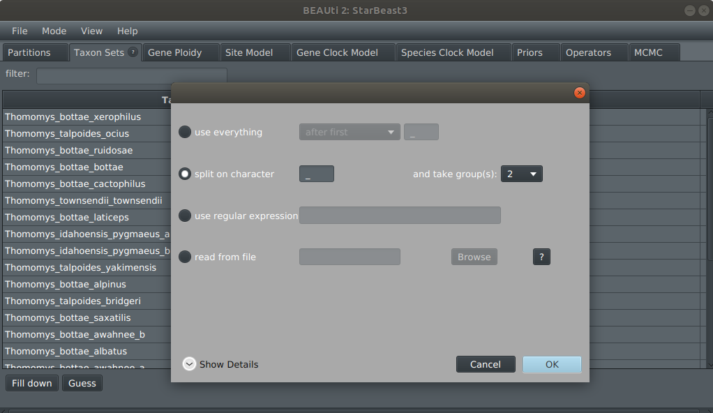
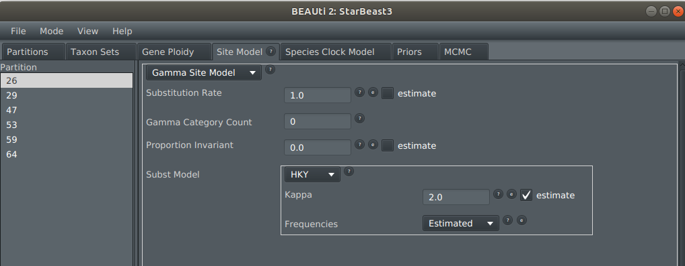
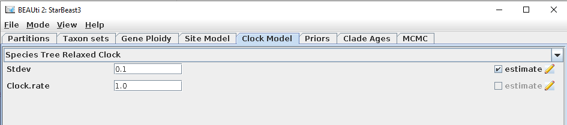

# StarBeast3

[BEAST 2](http://beast2.org) based package for Bayesian multispecies coalescent (MSC) analyses using efficient and parallelised MCMC operators.


## Installation

* Install BEAST 2 (available from [http://beast2.org](http://beast2.org)).
* Open BEAUti
* Select `File => Manage packages`
* Install starbeast3 package through the [package manager](http://www.beast2.org/managing-packages/) (this may automatically install some other package as well)


## Install manually (developer version)


This assumes you have BEAST 2 already installed on your machine https://www.beast2.org/


To install this package manually, first clone this repository and all of its dependencies from GitHub, including BEAST 2

```
mkdir beast2
cd beast2
git clone https://github.com/CompEvol/BEAST2
git clone https://github.com/BEAST2-Dev/BEASTLabs
git clone https://github.com/Rong419/ConstantDistanceOperator
git clone https://github.com/jordandouglas/ORC
git clone https://github.com/rbouckaert/starbeast3
```

Then navigate to into each directory and install them using ant

```
cd ../BEASTLabs
ant addon

cd ../ConstantDistanceOperator
ant addon

cd ../ORC
ant addon

cd ../starbeast3
ant addon

cd ../
```


Finally, extract the contents of these addons:

```
unzip -o BEASTLabs/build/dist/BEASTlabs.addon.v*zip -d ~/.beast/2.6/BEASTLabs/.
unzip -o ConstantDistanceOperator/build/dist/FastRelaxedClockLogNormal.addon.v*zip -d ~/.beast/2.6/FastRelaxedClockLogNormal/.
unzip -o ORC/build/dist/ORC.addon.v*zip -d ~/.beast/2.6/ORC/.
unzip -o starbeast3/build/dist/starbeast3.addon.v*zip -d ~/.beast/2.6/starbeast3/.
```


This assumes that BEAST 2 is installed in the ~/.BEAST 2/ directory. If the package directories do not exist there (eg. ~/.beast/2.6/starbeast3/) then the empty folders must be created first.

If you are not using BEAST 2.6 then replace 2.6 with the appropriate version number.
For more details see https://beast2.blogs.auckland.ac.nz/managing-packages/#Install_by_hand .


## Using StarBeast3

1. Open BEAUti, and select the StarBeast3 template  (menu `File/Templates/StarBeast3`).

2. Import one or more alignments using `File/Import Alignment` (example session: import `26.nex` and `29.nex`, which are located in the `beast/examples/nexus/` directory). Each alignment will serve as the data for 1 gene tree.

3. To create a species-to-taxon mapping, open the `Taxon sets` tab. For the example session, press `Guess` and then split on character `_` and take group `2`.



4. To define the ploidy of each gene tree, open the `Gene Ploidy` tab. The `Gamma Parameter` is the mean effective population size (denoted by &mu;N in the StarBeast3 article) and is estimated by default.

5. Set the site model of each gene tree in the `Site Model` tab. By default, the `Substitution Rate` (denoted by &nu; in article) is estimated for each gene tree.



6. Select a clock model using the `Clock Model` tab. 

    -   Under the `Species Tree Strict Clock`, every branch in the species tree has the same substitution rate. 
    -   Under the `Species Tree Relaxed Clock`, each species tree branch has an independently-and-identically distributed substitution rate with a LogNormal(mean = 1, logSD = Stddev) distribution, where Stddev is estimated (denoted by &sigma; in manuscript). The substitution rates of each gene tree branch are from the species tree. 

The `Clock.rate` can also be estimated, but this is not recommended unless time calibration data is available. 


7. Other priors, including the species tree prior, can be configured using the `Priors` tab.


8. Save the XML template using `File/Save`

9. Run BEAST on the saved XML file using
        ```beast/bin/beast -threads N starbeast3.xml```
where `N` is the number of threads allocated to the parallel gene tree operator (default 1). The gene trees are partitioned into `N` threads and operated on independently.

10. MCMC convergence can be measured using Tracer (see [https://www.beast2.org/tracer-2/](https://www.beast2.org/tracer-2/)).


11. The MSC model (including the species tree, gene trees, effective population sizes, and branch rates) can be visualised using UglyTrees (see [https://uglytrees.nz/](https://uglytrees.nz/)).


Also see tutorial for *BEAST (see [StarBEAST tutorial](https://taming-the-beast.org/tutorials/StarBeast-Tutorial/)).

## Questions about StarBeast3

BEAST user list: [https://groups.google.com/forum/#!forum/beast-users](https://groups.google.com/forum/#!forum/beast-users)

Jordan Douglas: [jordan.douglas@auckland.ac.nz](jordan.douglas@auckland.ac.nz)

Remco Bouckaert: [rbouckaert@auckland.ac.nz](rbouckaert@auckland.ac.nz)


## References

**StarBeast3** Douglas, Jordan, Cinthy L. Jiménez-Silva, and Remco Bouckaert. "StarBeast3: Adaptive Parallelised Bayesian Inference under the Multispecies Coalescent." Systematic Biology (2022).

**Optimised relaxed clock package:** Douglas, Jordan, Rong Zhang, and Remco Bouckaert. "Adaptive dating and fast proposals: Revisiting the phylogenetic relaxed clock model." PLoS computational biology 17.2 (2021): e1008322.

**Tracer:** Rambaut, Andrew, et al. "Posterior summarization in Bayesian phylogenetics using Tracer 1.7." Systematic biology 67.5 (2018): 901.

**UglyTrees:** Douglas, Jordan. "UglyTrees: a browser-based multispecies coalescent tree visualizer." Bioinformatics 37.2 (2021): 268-269.

**BEAST 2:** Bouckaert, Remco, et al. "BEAST 2.5: An advanced software platform for Bayesian evolutionary analysis." PLoS computational biology 15.4 (2019): e1006650.

**StarBeast:** Heled, Joseph, and Alexei J. Drummond. "Bayesian inference of species trees from multilocus data." Molecular biology and evolution 27.3 (2009): 570-580.

**StarBeast2**: Ogilvie, Huw A., Remco R. Bouckaert, and Alexei J. Drummond. "StarBEAST2 brings faster species tree inference and accurate estimates of substitution rates." Molecular biology and evolution 34.8 (2017): 2101-2114.


