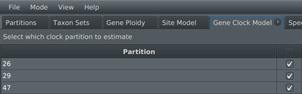
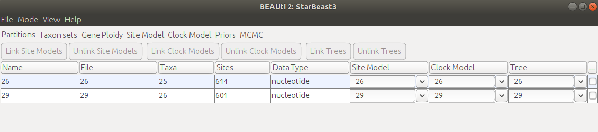

# StarBeast3

[BEAST 2](http://beast2.org) based package for Bayesian multispecies coalescent (MSC) analyses using efficient and parallelised MCMC operators. Also see StarBeast3  [blog post](https://www.beast2.org/2022/03/31/starbeast3.html).


This repository is currently being migrated to BEAST 2.7. Please see the v2.6 branch for compatability with BEAST 2.6.


## Installation

* Install BEAST 2 (available from [http://beast2.org](http://beast2.org)).
* Open BEAUti
* Select `File => Manage packages`
* Install starbeast3 package through the [package manager](http://www.beast2.org/managing-packages/) (this may automatically install some other package as well)


## Using StarBeast3


This tutorial is based on the Gopher example data by [Belfiore et al. 2008](https://doi.org/10.1080/10635150802044011).


1. Open BEAUti, and select the StarBeast3 template  (menu `File/Templates/StarBeast3`).

2. Import one or more alignments using `File/Import Alignment` (example session: import `26.nex` and `29.nex`, which are located in the `beast/examples/nexus/` directory). Each alignment will serve as the data for 1 gene tree.

3. To create a species-to-taxon mapping, open the `Taxon sets` tab. For the example session, press `Guess` and then split on character `_` and take group `2`.


4. To define the ploidy of each gene tree, open the `Gene Ploidy` tab. The ploidy is 2 by default.

5. Set the site model of each gene tree in the `Site Model` tab. 


6. The clock rate for each gene tree can be estimated or fixed using the `Gene Clock Model` tab. By default, all gene clock rates are estimated and are drawn from a Log-Normal prior. If there are a small number of loci, it may be preferrable to leave one of these fixed at 1.0. Note that these gene clock rates are relative to the clock rate definied in the  `Species Clock Model` tab, and thus should be sampled from a prior with a mean of 1.



7. Select a clock model using the `Species Clock Model` tab. 

--  **Species Tree Strict Clock**: Every branch in the species tree has the same substitution rate. 


--  **Species Tree Relaxed Clock**: Each species tree branch has an independent and identically distributed substitution rate with a LogNormal(mean = 1, logSD = Stddev) distribution, where Stddev is estimated (denoted by &sigma; in StarBeast3 manuscript). The substitution rates of each gene tree branch are from the species tree. The mean branch rate is fixed at 1 so that it does not interfere with tree height estimation.


The species tree `Clock.rate` can also be estimated (Ensure that `Mode => Automatic set clock rate` is unchecked), but this is not recommended unless time calibration data is available. If you estimate the `Clock.rate` (denoted by &mu; in the StarBeast3 article), you should also change its default 1/X prior to an informed prior (such as a Log-Normal distribution centered around an informed estimate). If the clock rate is left as default, then the tree heights will be in units of substitutions per site. If the clock rate is estimated, then the clock rate should be in units of substitutions per site per units of time, so that the tree heights are in units of time (eg. millions of years). 


8. Other priors, including the species tree prior, can be configured using the `Priors` tab. The following species tree priors are included:


-- **Yule Model**. A model which describes the branching process of species, i.e.  speciation, or births . Estimated parameters: speciationRate (the rate of one species diversifying into two).


-- **Calibrated Yule Model**. Same as above, but with time point calibrations. Estimated parameters: cySpeciationRate (same as above). Requires calibrations, which can be added using `+ Add Prior`.


-- **Birth Death Model**. A model which describes both the branching (birth) and extinction (death) of species. Estimated parameters: netDiversificationRate (the species birth rate minus the species death rate; this is the same as the Yule Model since its death rate is 0); ExtinctionFraction (the death rate divided by the birth rate). 
This model assumes that the birth rate is greater than the death rate, and therefore the species is not going extinct. If ExtinctionFraction is 0, then it is equivalent to the Yule model.


-- **Yule skyline collapse.** A species boundary detection method, built on top of the Yule model. See [speedemon](https://github.com/rbouckaert/speedemon) package for further details.


Additionally, `popMean` is the mean effective population size (denoted by &mu;N in the StarBeast3 article), and the `clockRates` are the relative subsitution rate of each gene tree. By default, these are log-normal distributions with a small variance and a mean of 1, to avoid interference with tree height estimation, and the clock rate of the first partition is fixed at 1. 

9. Save the XML template using `File/Save`

10. Run BEAST on the saved XML file using
        ```beast/bin/beast -threads N starbeast3.xml```
where `N` is the number of threads allocated to the parallel gene tree operator (default 1). The gene trees are partitioned into `N` threads and operated on independently.

11. MCMC convergence can be measured using Tracer (see [https://www.beast2.org/tracer-2/](https://www.beast2.org/tracer-2/)).


12. The MSC model (including the species tree, gene trees, effective population sizes, and branch rates) can be visualised using UglyTrees (see [https://uglytrees.nz/](https://uglytrees.nz/)).


Also see tutorial for *BEAST (see [StarBEAST tutorial](https://taming-the-beast.org/tutorials/StarBeast-Tutorial/)).


## Linking models

Gene tree models can be linked across the partitions in the Partitions tab of BEAUti, as per usual. However, we advise caution when linking models in StarBeast3, as discussed below.




### A note on performance

The runtime performance of StarBeast3 benefits from its ability to parallelise inference of gene trees and their site models. This complex operation requires the set of parameters operated on in each thread to be conditionally independent (e.g. two threads must not operate on the same gene tree or the same site model). If the models are heavily linked, then this hampers the ability of StarBeast3 to parallelise inference.  

From a performance perspective, we therefore recommend the user only link (site and clock) models when there is good reason.  


### Clock model
By default, each gene tree is associated with its own relative clock rate, and these rates have a prior distribution with a mean of 1. The substitution rate of a branch in a gene tree is equal to its clock rate multiplied by the clock rate of the species tree (configured in the "Clock Model" tab). This model works quite well and accounts for different genetic loci being exposed to unique selective pressures. When there are many genes trees, the clock rate estimates average out to ~1.0, and therefore are able to be estimated without affecting the estimated species tree height. 

If gene tree clock models are linked, then they will share their clock rate. However, as discussed above, excessive linking can hamper parallelisation performance and lead to slightly longer convergence times.

### Site model

If the site model is linked, then multiple gene trees will share a site model (and its parameters). This simplification may be preferred in some cases, however, as discussed above, excessive linking can also lead to slightly longer convergence times.


### Tree model

If the tree model is linked, then multiple partitions will share the same gene tree. However, the partitions will still have different site models and clock rates, unless the site model and clock models are also linked. Linking trees is useful for combining mitochondrial partitions into a single phylogeny, for example, and can greatly reduce the search space. We recommend linking trees when there is too much data to achieve convergence in a timely manner.


## Questions about StarBeast3


BEAST user list: [https://groups.google.com/forum/#!forum/beast-users](https://groups.google.com/forum/#!forum/beast-users)

Jordan Douglas: [jordan.douglas@auckland.ac.nz](jordan.douglas@auckland.ac.nz)

Remco Bouckaert: [r.bouckaert@auckland.ac.nz](r.bouckaert@auckland.ac.nz)


## References

**StarBeast3:** Douglas, Jordan, Cinthy L. Jiménez-Silva, and Remco Bouckaert. "StarBeast3: Adaptive Parallelised Bayesian Inference under the Multispecies Coalescent." Systematic Biology (2022).

**Optimised relaxed clock package:** Douglas, Jordan, Rong Zhang, and Remco Bouckaert. "Adaptive dating and fast proposals: Revisiting the phylogenetic relaxed clock model." PLoS computational biology 17.2 (2021): e1008322.

**Tracer:** Rambaut, Andrew, et al. "Posterior summarization in Bayesian phylogenetics using Tracer 1.7." Systematic biology 67.5 (2018): 901.

**UglyTrees:** Douglas, Jordan. "UglyTrees: a browser-based multispecies coalescent tree visualizer." Bioinformatics 37.2 (2021): 268-269.

**BEAST 2:** Bouckaert, Remco, et al. "BEAST 2.5: An advanced software platform for Bayesian evolutionary analysis." PLoS computational biology 15.4 (2019): e1006650.

**StarBeast:** Heled, Joseph, and Alexei J. Drummond. "Bayesian inference of species trees from multilocus data." Molecular biology and evolution 27.3 (2009): 570-580.

**StarBeast2**: Ogilvie, Huw A., Remco R. Bouckaert, and Alexei J. Drummond. "StarBEAST2 brings faster species tree inference and accurate estimates of substitution rates." Molecular biology and evolution 34.8 (2017): 2101-2114.

